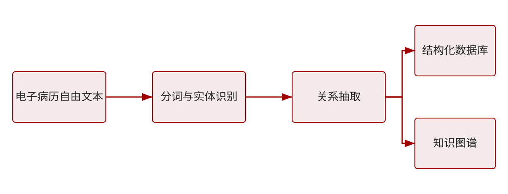

# 目录

## 研究背景
english: Research Background

### 1.1 研究背景与动机
电子病历在临床实践中积累了海量的自由文本数据，但这些文本高度非结构化，难以直接用于统计分析与临床决策支持。

这里有一个需要强调的重点：**电子病历自由文本的结构化是医学数据科学的重要基础**，它直接决定了下游分析任务的质量。

caption: 图1 电子病历自由文本结构化的总体流程

### 1.2 研究意义
- 提升临床科研数据的可用性与可复现性
- 为智能辅助诊断提供高质量结构化输入
- **降低人工标注与数据整理的时间成本**

## 研究方法
english: Methods

### 2.1 总体技术路线
本研究采用"数据采集—清洗脱敏—标注—建模"的总体技术路线，确保数据质量与方法的可扩展性。

caption: 图2 数据来源与处理流程

### 2.2 模型结构
我们提出一个端到端的序列标注模型，融合预训练语言表示与条件随机场解码。

caption: 图3 端到端结构化模型架构

## 研究结果
english: Results

### 3.1 主要实验结果
在真实临床数据集上，本文方法在实体识别 F1 指标上显著优于基线方法。

caption: 图4 不同方法在测试集上的 F1 对比

### 3.2 消融实验
| 模型配置 | 准确率 | 召回率 | F1 |
| --- | --- | --- | --- |
| 规则法 | 71.2 | 65.4 | 68.2 |
| CRF | 78.5 | 74.1 | 76.2 |
| BiLSTM-CRF | 85.3 | 82.7 | 84.0 |
| 本文方法 | 91.6 | 90.2 | 90.9 |

## 研究结论
english: Conclusion

### 4.1 结论与展望
本文提出的结构化方法在中文医学文本上取得了良好效果，**未来将进一步探索多中心数据上的迁移与泛化能力**。
