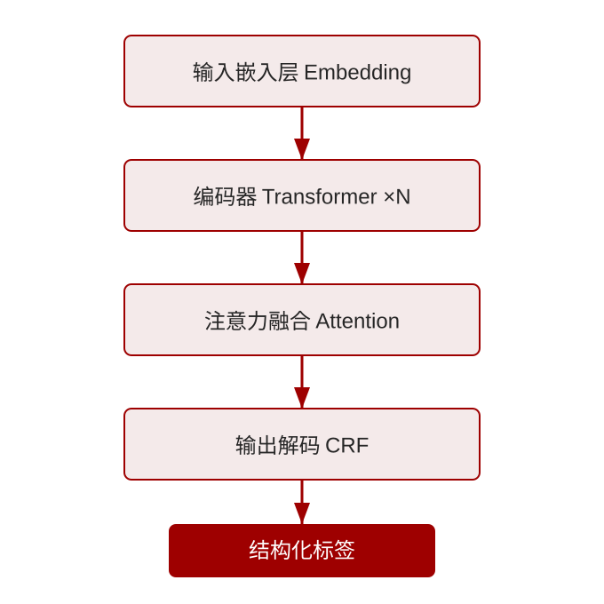
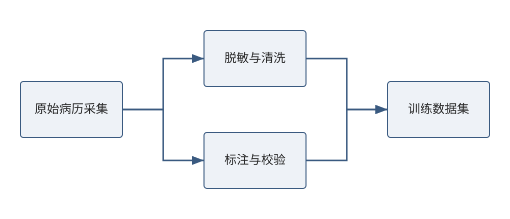
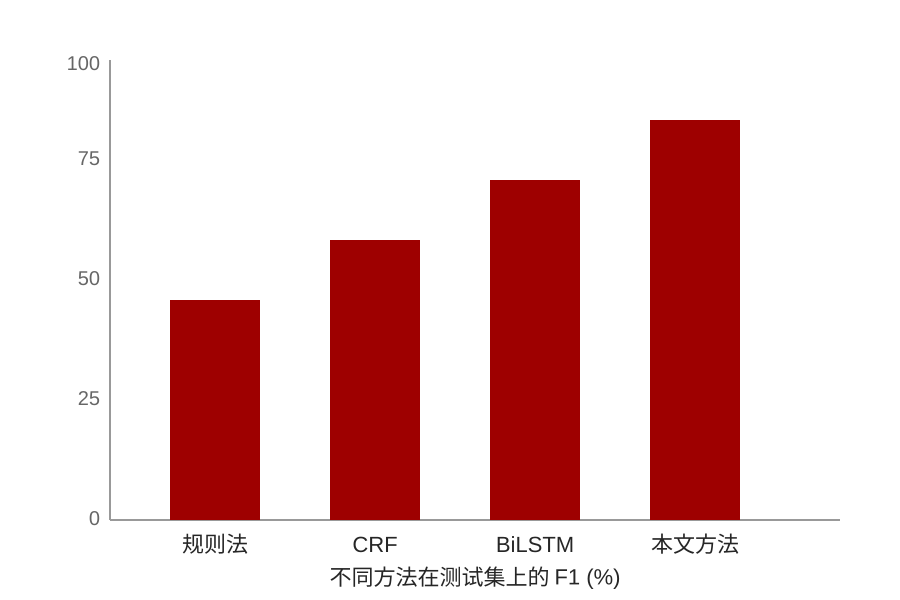

# 目录

## 绪论背景
english: Introduction Background

### 1.1 研究背景
医学影像是临床诊断的重要依据，深度学习的发展为影像自动分析带来了新的机遇。

随着多模态数据的普及，**如何有效融合影像、文本与结构化信息成为关键科学问题**。

### 1.2 研究问题
- 单模态模型难以充分利用临床多源信息
- 标注数据稀缺，模型泛化能力不足
- **多模态对齐与融合缺乏统一框架**

## 研究思路方法
english: Research Ideas And Methods

### 2.1 总体框架
本研究构建统一的多模态表示学习框架，支持影像与文本的协同建模。

caption: 图1 多模态表示学习总体框架

### 2.2 数据流程

caption: 图2 数据采集、脱敏与标注流程

## 关键技术难点
english: Key Technologies

### 3.1 三项关键技术
- 跨模态对齐
- 弱监督预训练
- 不确定性估计

## 研究成果
english: Research Findings

### 4.1 主要结果
在多个公开数据集上，本文方法相比基线取得稳定提升。

caption: 图3 不同方法的性能对比

### 4.2 定量评估
| 数据集 | 基线 AUC | 本文 AUC | 提升 |
| --- | --- | --- | --- |
| 数据集 A | 0.882 | 0.931 | +4.9 |
| 数据集 B | 0.857 | 0.910 | +5.3 |
| 数据集 C | 0.873 | 0.925 | +5.2 |

## 总结与展望
english: Summary And Outlook

### 5.1 总结与展望
本文提出的多模态框架在医学影像分析中表现出色，**未来将拓展到更多临床场景与实时推理部署**。
